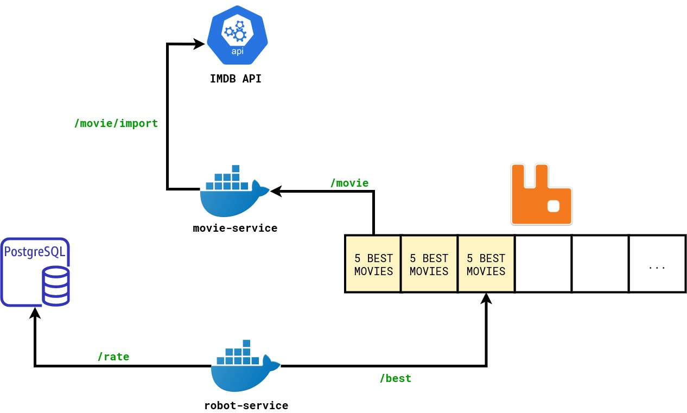

# Generic Movie service API

## 1. Prerequisites

| Software          | Version | Importance |
| ----------------- | ------- | ---------- |
| 🐳 Docker         | 20.10.6 | Required   |
| 🐙 Docker Compose | 1.29.1  | Required   |
| 🔗 cURL           | 7.68.0  | Required   |
| 🐃 GNU Make       | 4.2.1   | Required   |

## 2. Getting started 🏁

1. Run `make prepare`.
2. Fill the file `config.py` with your own credentials. ⚠️**WARNING**⚠️: all the constants
   on the `config.py.example` file work correctly, you only have to change the `OMDB_API['KEY']` variable if you want.
3. Run `make dc`, this may take a while.
4. Run `make API_KEY=8031c622 import-movies`. The `8031c622` is my personal API KEY, this key shouldn't be shared.
5. Run `make rate`, this command starts the movie rating task, and queues the best 5 movies on RabbitMQ (robot).
   This robot rates every **30 seconds**, this time can be modified on `FREQUENCY_RATE` variable in `src/robot_service/config.py` file.
6. Run `make get-movies`, get the best ranked movies from RabbitMQ.

### 2.1 Used ports

| Port  | Description         |
| ----- | ------------------- |
| 8090  | Main Service        |
| 8091  | Robot               |
| 15672 | RabbitMQ (UI)       |
| 5672  | RabbitMQ (internal) |
| 5432  | PostgreSQL          |

### 2.2 Endpoints

| Endpoint      | Type/Port | Description                                          |
| ------------- | --------- | ---------------------------------------------------- |
| /movie/import | GET/8090  | Import movies from the IMDB API                      |
| /rate         | GET/8091  | Rating each 5 random movies.                         |
| /best         | GET/8091  | Get the best rated movies and send to RabbitMQ queue |
| /movie        | GET/8090  | Obtain the 5 best rated movies from RabbitMQ queue   |

## 3. Steps 👣

### 3.1 Read the API documentation

- We can found the documentation on this [link](https://www.omdbapi.com/apikey.aspx).
- We can get the API Key by registering from this [link](https://www.omdbapi.com/apikey.aspx) (with free 1000 API calls
  per day)

### 3.2 Read the RabbitMQ documentation

- We can found the documentation on this [link](https://www.rabbitmq.com/getstarted.html).

### 3.3 Make a simple diagram

### 3.4 Execution example

1. `make prepare`

## 4. Flaws 😢

1. The `config.py.example` values should be empty and do not have to be versioned.
2. The `movie_service` and `robot_service` should be separated on different repositories.
3. Input data validator.
4. No unit and integration testing.
5. No postman documentation.
